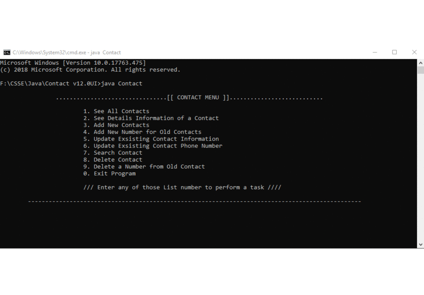

# ContactListConsole
it's a simple contact list app based on command line interface. I also implemented the GUI version using JSwing later on.

To run this Project you need JRE. Using which java runs in all platforms. you basically have to Install JVM in your Mechine to run the Project. 

Make sure your java path is properly set. Then clone/Download the project. Go to Project directory. Open Command Promt in the Directory and type command 'javac Contact.java' press Enter and then again type 'Java Contact' and prerss Enter to run the Project.

# Demo

